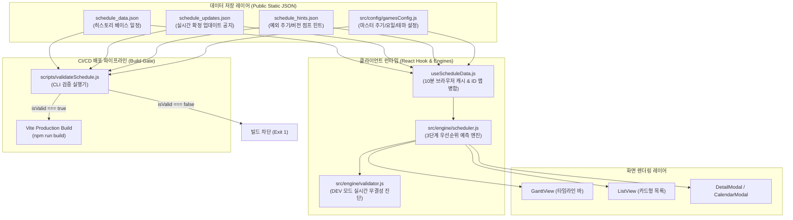
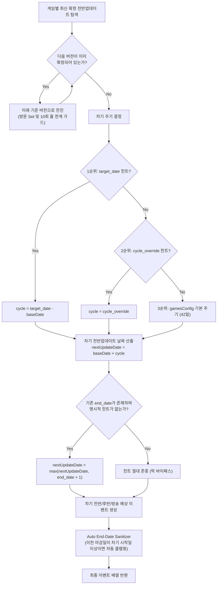
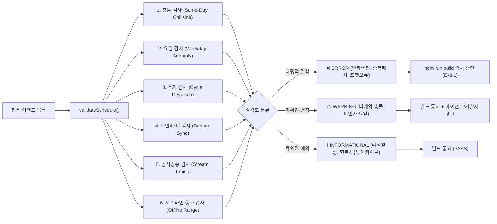

# 🏛️ 서브컬처 게임 일정 시스템 종합 아키텍처 & 운영 백서

> **문서 버전**: v2.1.0  
> **최종 갱신**: 2026-09-19  
> **대상 시스템**: AEIKA Subculture Game Dashboard (`scheduler.js`, `validator.js`, `useScheduleData.js`, 데이터 레이어)

---

## 1. 시스템의 목적 및 차별화 강점 (Core Purpose & Value)

### 1.1 대상 게임군의 특성과 도메인 공통 규칙
본 시스템이 다루는 5대 서브컬처 라이브 서비스 게임은 업계 표준에 가까운 **고도의 유사성과 엄격한 주기 규칙**을 공유합니다:

| 게임 | 기준 점검 요일 | 허용 점검 요일 | 표준 버전 주기 | 전/후반 분할 | 방송 예고 시점 |
|---|---|---|---|---|---|
| **원신** | 수요일 (3) | 수요일 고정 | 42일 (6주) | 21일 / 21일 | 패치 12일 전 (금) |
| **붕괴: 스타레일** | 수요일 (3) | 수요일 중심 | 42일 (6주) | 21일 / 21일 | 패치 12일 전 (금) |
| **젠레스 존 제로** | 수요일 (3) | 수요일 고정 | 42일 (6주) | 21일 / 21일 | 패치 12일 전 (금) |
| **명조** | 목요일 (4) | 목요일 중심 | 42일 (6주) | 21일 / 21일 | 패치 13일 전 (금) |
| **명일방주: 엔드필드** | 목요일 (4) | 수, 목, 금 유동 | 42일 (6주) | 21일 / 21일 | 패치 7일 전 (목) |

### 1.2 사이트만의 고유 강점: 미래 일정 예측 엔진 (Prediction Engine)
- **일반 커뮤니티의 한계**: 인벤, 아카라이브, 트위터 등 기존 매체는 공식 공지가 발표된 '확정 일정'만을 사후 기록·열람하는 수동적 게시판에 불과합니다.
- **AEIKA 대시보드의 차별점**:
  - 공식 발표 이전에도 도메인 수학 모델을 바탕으로 **1~2개 버전 앞의 미래 일정(전반 패치, 후반 픽업 전환, 공식 프리뷰 방송)을 선제적으로 계산하여 간트 차트에 시각화**합니다.
  - 이용자는 이를 통해 캐릭터 픽업 계획, 유료/무료 재화 수급 계산, 오프라인 행사 일정을 수개월 전부터 시뮬레이션할 수 있습니다.

### 1.3 도메인 변수와 도전 과제
완벽한 42일 규칙 속에서도 현실에서는 다음과 같은 **외생적 변수**가 끊임없이 발생합니다:
1. **주년 행사 조율**: 스타레일 4.5(33일 단축)처럼 주년 및 오프라인 페스티벌 시점을 맞추기 위한 비정규 단축.
2. **국가별 연휴 및 글로벌 이슈**: 중국 춘절, 한국 추석, 국경절 골든위크에 서버 점검을 피하기 위한 1~2일 앞당김(수/금 점검).
3. **대형 IP 콜라보레이션**: 명조 3.4 사이버펑크 콜라보(32일 주기) 같은 외부 라이선스 계약 기간에 따른 변칙.
4. **신작 게임의 시스템 안정화**: 엔드필드처럼 런칭 초기 개발 일정에 따라 수~금요일 사이 유동적 점검 발생.

---

## 2. 전체 시스템 구조 및 데이터 파이프라인 (Architecture & Data Flow)

시스템은 복잡한 데이터베이스 서버 없이도 고가용성과 초고속 응답을 보장하는 **정적 JSON + 브라우저 클라이언트 연산(Static JSON + Client-side Compute)** 하이브리드 아키텍처를 채택하고 있습니다.



### 2.1 4대 데이터 소스의 엄격한 역할 분담
1. **`gamesConfig.js` (헌법 / Master Rule)**: 게임별 기본 점검 요일(`standardWeekday`), 허용 요일(`allowedWeekdays`), 표준 주기(`cycle: 42`), 방송 오프셋(`streamOffset: -12`) 정의.
2. **`schedule_data.json` (기초 아카이브 / Base History)**: 과거 버전 및 완료된 일정의 누적 저장소.
3. **`schedule_updates.json` (실시간 오버레이 / Live Overlay)**: 공식 발표된 신규 일정 주입. ID 매핑을 통해 `schedule_data.json`을 덮어씀.
4. **`schedule_hints.json` (도메인 힌트 / Domain Intelligence)**: 
   - `cycle_override`: 변칙 주기 지정 (예: 33일, 44일)
   - `target_date`: 목표 릴리즈 날짜 절대 지정
   - `next_version_number`: 대형 지역 점프 (`3.7 -> 4.0`, `6.7 -> 7.0`)
   - `stream_date_override` / `skip_stream`: 방송 변칙 통제

---

## 3. 핵심 엔진 동작 원리 (Engine Mechanics)

### 3.1 예측 엔진 (`scheduler.js`)의 3단계 우선순위 연쇄 알고리즘



#### 핵심 알고리즘 메커니즘:
1. **버전 순환 방어 가드 (Loop Guard)**: `visitedFixedVersions` Set을 두어 버전 넘버링 순환 참조 시 무한 루프를 원천 차단.
2. **동적 락 바이패스 (Dynamic Lock Bypass)**: 최신 기준 버전(`currentBaseVer`)에 명시적 힌트(`cycle_override` 또는 `target_date`)가 등록되어 있으면 낡은 배너 마감일에 얽매이지 않고 힌트 일자를 100% 관철.
3. **공식 방송 연쇄 타겟팅**: 확정 방송이 이미 존재하는 경우, 기준 버전의 고유 주기를 정밀 조회하여 차기 방송일을 오프셋(`streamOffset`)에 맞춰 역산출.
4. **마감일 2중 방어선 (Auto End-Date Sanitizer)**: 수동 데이터에 마감일 오차가 있더라도, 렌더링 단계에서 차기 버전 시작 전날 23:59로 자동 클리핑(Sanitize)하여 간트 차트 겹침을 물리적으로 차단.

---

### 3.2 정합성 검증 엔진 (`validator.js`) 및 빌드 게이트

검증기는 단순한 로그 출력 도구가 아니라 **잘못된 데이터의 프로덕션 배포를 차단하는 보안 게이트(Quality Gate)**입니다.



---

## 4. 왜 그동안 오류가 반복되었는가? (과거 근본 원인 분석)

| 과거 문제점 | 기술적 원인 (Root Cause) | 해결 및 개선 조치 (현재) |
|---|---|---|
| **엔드필드 1일 오차 발생** | 특정 요일(금요일)을 목요일로 무조건 하루 당기던 **하드코딩 보정 로직** (`getDay() === 5 ? -1`) 내장 | 하드코딩 완전 제거, `allowedWeekdays: [3, 4, 5]` 설정 및 힌트 기반 자연 예측으로 전환 |
| **새 버전이 안 당겨지는 락 현상** | 이전 버전 배너의 수동 `end_date`가 차기 시작일을 강제로 밀어내던 floor 로직 | 최신 기준 버전의 힌트 감지 시 `end_date` 락을 무력화하는 **힌트 바이패스** 구현 |
| **스타레일 4.7 방송 조기 예측** | 방송 도약 시 직전 버전 주기가 아닌 과거 버전(4.5 33일)의 `currentBaseCycle`을 오참조 | 도약 기준 버전의 고유 힌트 주기를 직접 조회하도록 스코프 수정 |
| **사람의 수동 계산 오류** | 기간 단축 정보를 에이전트가 7일로 잘못 계산하여 9일 오차 발생 | 사람은 공지 사실만 제공하고, 날짜 계산은 **엔진과 힌트가 100% 전담**하는 SOP 확립 |
| **잘못된 데이터 배포 위험** | 오프라인 행사만 에러로 잡고 게임 데이터 날짜 역전은 통과시키던 심각도 역전 | 날짜 역전 및 중복 패치를 **치명적 ERROR로 승격**하여 빌드 자동 차단 |

---

## 5. 표준 운영 절차 (SOP: Standard Operating Procedure)

새로운 게임 공지나 일정을 등록할 때 에이전트와 운영자가 준수하는 단일 파이프라인입니다.

### 5.1 일정 등록 4단계 절차
```
[1단계: 공지 수집 및 사실 확인]
  └ 패치 날짜, 기간 변동, 후반 전환일, 방송일 확인 (날짜 직접 계산 금지)
       ↓
[2단계: 데이터 주입]
  ├ 일반 일정 ➔ public/data/schedule_updates.json
  ├ 변칙 주기 / 대형 점프 ➔ public/data/schedule_hints.json (사유 note 필수 기재)
  └ 공식 일러스트 ➔ 파일 첨부 폴더 ➔ public/assets/*.webp 변환 배치
       ↓
[3단계: 정합성 검증 실행]
  └ 터미널: npm run validate
       ├ ❌ ERROR 발생: 데이터 역전/오타 즉시 수정 후 재검증
       ├ ⚠️ WARNING 발생 (경로 A: 단순 계산 오차): 힌트/데이터 재조정
       ├ ⚠️ WARNING 발생 (경로 B: 타 게임 충돌 등 판단 모호): 작업 중단 후 사용자 보고
       └ ✅ PASS: 다음 단계 진행
       ↓
[4단계: 빌드 및 배포]
  └ npm run build (검증 게이트 자동 통과 확인) ➔ git commit & push
```

### 5.2 에이전트-운영자 역할 분담 원칙
- **운영자 (사용자)**: 공식 공지의 핵심 팩트(일정 텍스트, 공식 링크, 첨부 일러스트)만 제공.
- **에이전트 (AI)**:
  - 직접 날짜를 암산하지 않고, 시스템 규칙과 힌트 체계(`schedule_hints.json`)를 통해 엔진이 연산하도록 데이터 구조화.
  - 빌드 전 반드시 `npm run validate`를 실행하여 `[OK]` 승인 여부 확인 후 배포.
